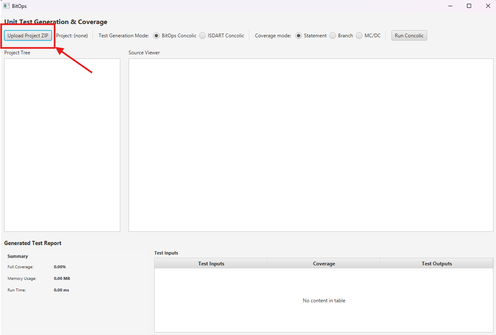
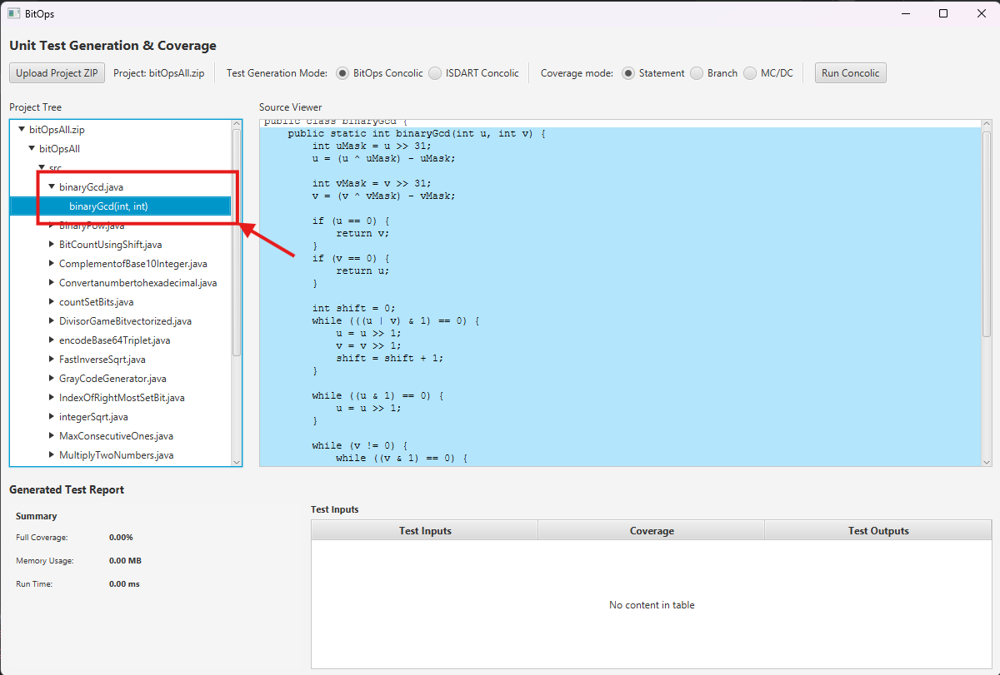
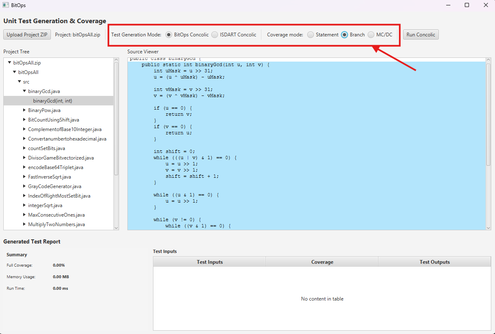
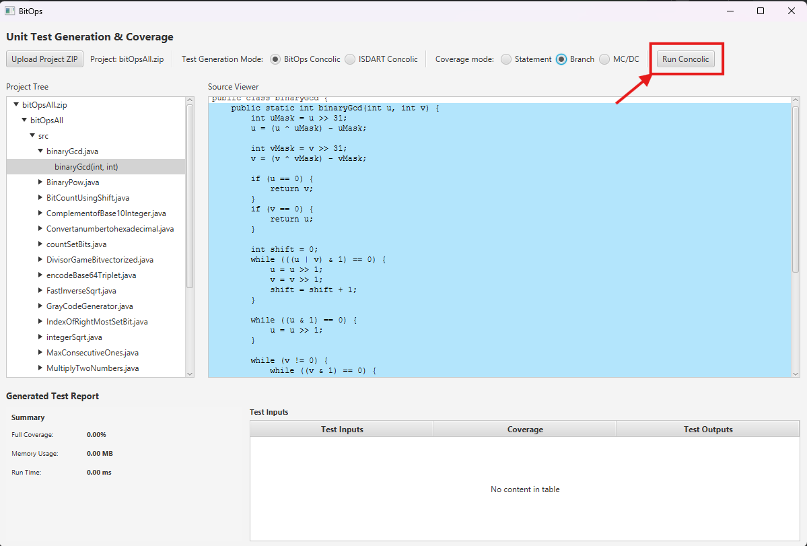
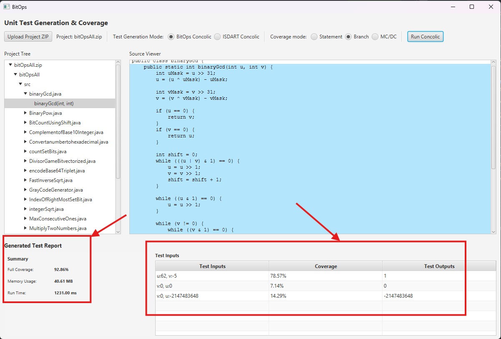

# BitOps: A Concolic-Based Test Input Generation Method for Units with Bit Operators of Java Projects

BitOps is the prototype tool developed for the research *"BitOps: A Concolic-Based Test Input Generation Method for Units with Bit Operators of Java Projects"*. It implements concolic (concrete + symbolic) execution with dedicated support for bitwise and shift operators (`&`, `|`, `^`, `~`, `<<`, `>>`, `>>>`), addressing a common gap in existing concolic testing tools by encoding bitwise semantics as Z3 BitVector constraints. This enables accurate path exploration and complete test input generation for Java units that involve bit operators, across multiple coverage criteria (Statement, Branch, MC/DC), via a JavaFX-based GUI.

---

## Prerequisites

- **Java 17** – [Download here](https://www.oracle.com/java/technologies/javase/jdk17-archive-downloads.html). Make sure `JAVA_HOME` points to JDK 17. ([Setup guide](https://www.youtube.com/watch?v=YONvtseO574))
- **Maven 3.x** – bundled with most IDEs (IntelliJ IDEA recommended) or [install manually](https://maven.apache.org/install.html)
- **IntelliJ IDEA** (or any Maven-compatible Java IDE)

---

## Installation & Setup

### Step 1: Clone the Repository

```bash
git clone https://github.com/LeHoaiNam756/Bitops.git
cd Bitops
```

### Step 2: Configure the Project Root Path

Open `src/main/java/core/utils/FilePath.java` and update the `JCIA_PROJECT_ROOT_PATH` constant to the absolute path where you cloned the project on your machine:

```java
public static final String JCIA_PROJECT_ROOT_PATH = "C:\\path\\to\\Bitops";
```

### Step 3: Add the Z3 Library

The Z3 version available on Maven Central is outdated, so the required JAR (`com.microsoft.z3.jar` v4.14.0) is bundled locally under `src/main/java/core/lib/`.

Install it into your local Maven repository by running:

```bash
mvn install:install-file \
  -Dfile="<project-path>/src/main/java/core/lib/com.microsoft.z3.jar" \
  -DgroupId="com.microsoft" \
  -DartifactId="z3" \
  -Dversion="4.14.0" \
  -Dpackaging=jar
```

> **If the command fails**, locate your `.m2` folder (typically `C:\Users\<YourName>\.m2\repository`) and manually create the directory `com\microsoft\z3\4.14.0`, then copy the JAR file into it. Reload the Maven project afterwards.

### Step 4: Build the Project

```bash
mvn clean install -DskipTests
```

---

## Running the Tool

Open `src/main/java/Main.java` in your IDE and run the `main` method. The JavaFX GUI will launch.

**Using the GUI:**

1. Load your Java project by selecting the source file or project zip file via the file browser.

2. Select the class and method you want to test from the project tree.
   
3. Choose test generation mode (**BitOps** or **ISDART**) and run coverage mode (**Statement**, **Branch**, or **MC/DC**).
   
4. Click **Run** to start concolic test generation.
   
5. View the generated test inputs, coverage results, and execution output in the report table.
6. 
